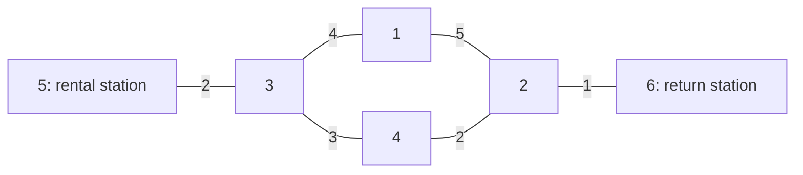

# Bike Rental Revenue Analysis — C++ Data Structures Portfolio

## Background

This project began as my final project for a 2021 data structures course. I am revisiting my original C++ program to preserve its history, make its build and tests reproducible, and document how I used AI to help trace code, design boundary cases, and review changes. I evaluate proposed changes against the assignment specification and observed results before adopting them.

The program reads an undirected station map, initial bike inventories, rental rates, and time ordered rental and return events. It produces responses, final inventories, and revenue for a basic policy (Part 1) and an advanced policy (Part 2).

## Original design and policies

- **Graph and shortest paths:** An adjacency matrix represents the undirected station map. A custom implementation of Dijkstra’s algorithm calculates shortest travel times. A rental uses the discounted rate when its duration equals the shortest travel time; otherwise, it uses the regular rate.
- **Inventory:** Each station and bike type has a custom min heap. The bike with the smallest ID is rented first.
- **Part 1:** Accept a request when the requested type is available at that station; otherwise, reject it. Returns update inventory and revenue.
- **Original Part 2:** Attempt to move a bike from a nearby station to a station lacking that type. If the requested type is unavailable, attempt a discounted rental of another type. Use the Part 1 result if the calculated Part 2 revenue is lower.

Part 2 is a **heuristic**. The current evidence does not establish that it maximizes revenue in every scenario.

## Example: graph search and rental pricing

This separately authored example uses an undirected graph with two routes from station 5 to station 6. Edge labels show travel time in minutes. The exact inputs are in `examples/graph_pricing/test_case/`.



The route through station 4 takes `2 + 3 + 2 + 1 = 8` minutes; the route through station 1 takes `2 + 4 + 5 + 1 = 12` minutes. The program stores both directions of each edge in an adjacency matrix. On a return, it runs its Dijkstra implementation from the rental station and uses the shortest travel time to the return station as the pricing benchmark.

| Selected station | Distance from station 5 | Relevant update |
|---|---:|---|
| 5 | 0 | Tentative distance to station 3 becomes 2. |
| 3 | 2 | Distances to stations 4 and 1 become 5 and 6. |
| 4 | 5 | Distance to station 2 becomes 7. |
| 1 | 6 | The alternative distance to station 2 is 11, so 7 remains. |
| 2 | 7 | Distance to station 6 becomes 8. |
| 6 | 8 | The pricing benchmark is 8 minutes. |

Station 5 starts with two road bikes. Two users rent there and return at station 6. The road bike rates in this example are 15 per minute when the rental duration equals the shortest travel time, and 25 per minute otherwise.

| User | Actual duration | Shortest travel time | Rate | Part 1 charge |
|---|---:|---:|---:|---:|
| `00001` | 8 minutes | 8 minutes | 15 per minute | 120 |
| `00002` | 10 minutes | 8 minutes | 25 per minute | 250 |

The locally verified Part 1 result accepted both rentals, collected **370**, and placed road bikes `500` and `501` at station 6. Part 2 also reported revenue of 370 on this input; this example illustrates Part 1 pricing and does not infer which internal Part 2 decisions produced that result.

After building the program, reproduce the example from the repository root:

```bash
cd examples/graph_pricing
../../build/bike_rental
```

Check the final line of `part1_status.txt` for `370` and the station 6 inventory for `road:500 501`. The input records rental and return stations and times; it does not record which road each rider actually took. The graph provides the shortest-time benchmark for pricing.

## Example: when a transferred bike becomes available

Suppose station 1 has no electric bikes, station 2 has two, and the shortest trip between them takes 10 minutes. Part 2 initiates a transfer from station 2 to station 1 at time 0.

| Event | Expected inventory decision |
|---|---|
| Time 9: request an electric bike at station 1 | Reject: the transferred bike is still in transit. |
| Time 10: first request at station 1 | Accept: the bike has arrived. |
| Time 10: second request at station 1 | Reject: requests are processed in input order, and the first renter took the only available bike. |

The original program placed a transferred bike in the destination inventory when it made the transfer decision. That allowed a rental before the bike arrived. The revised version keeps transfers pending and adds a bike to the destination inventory when its arrival time is reached. I checked this boundary case and reran the three provided open test cases in an isolated environment and in my local WSL environment.

## AI assisted investigation and reviewed changes

| Evidence | Original behavior | Reviewed change and verification |
|---|---|---|
| Specification and output comparison | Part 2 status omitted `road:` headings; transfer lines lacked a space after `transfer`. | Corrected the output stream and format. Part 1 output remained unchanged. |
| Shortest path and event time comparison | A transferred bike could be rented before arrival. Sorting distances also altered the original distance data used in transfer decisions. | Preserved the unsorted distances and added bikes to inventory at arrival. Checked times 9 and 10, including two requests at the same time. |
| Small discount example | One substitution produced both `discount <type>` and `accept`. The program rounded the discounted total instead of the per minute rate. | Produced one `discount <type>` response and rounded the discounted per minute rate before multiplying by duration. The example yields 18 rather than the original 17. |
| Low revenue example | Part 2 may need to use the basic policy result. | Confirmed that both Part 2 output files match their Part 1 counterparts when fallback is selected. |

These cases document a review sequence: **specification → AI assisted investigation → my review → minimal reproduction → change → regression check**. Each result should remain linked to its input and output so a reader can inspect the evidence.

## Results on the provided open test cases

| Test case | Part 1 revenue | Revised Part 2 revenue | Difference |
|---|---:|---:|---:|
| open_basic1 | 24,210 | 24,210 | 0 |
| open_basic2 | 375,995 | 393,356 | +17,361 |
| open_basic3 | 1,680,165 | 1,701,461 | +21,296 |

These figures compare the basic policy (Part 1) with the reviewed advanced policy (Part 2) on three course-provided open cases. They are not a before-and-after measurement of the AI-assisted code changes, and they do not establish a global optimum or correctness on hidden cases. The course inputs remain local, so these results are reported as local verification rather than publicly reproducible tests. The separately authored example and automated regression tests in this repository can be reproduced publicly.

## Limitations and future work

Further work includes independent accounting of events, revenue, and bike movements; more valid and boundary inputs; and review of fixed capacities, input error handling, and performance on larger cases. I also plan to analyze the time and space costs of the adjacency matrix, shortest path algorithm, and min heaps, then evaluate alternative graph representations and transfer policies.

The model could inform discussions of shared vehicles, equipment lending, or inventory transfers across locations. These are possible extensions, not features currently implemented.

## Provenance and data scope

I wrote the original program for a data structures course. This repository contains a reviewed version of that program, my documentation, and separately authored test inputs. The course specification, illustrations, provided test cases, original report, and student-ID-named files remain outside this repository. The original source and its initial outputs are preserved locally.

The change record distinguishes original behavior, AI-assisted investigation, my review, and observed verification. The public regression tests cover specific boundary cases; results from course-provided inputs are summarized without redistributing those inputs.

## Build and run

Requirements: a C++11 compiler on Linux. The current version was built with g++ 11.4 on Ubuntu 22.04 under WSL. The original course environment specified Ubuntu 20.04 and C++11.

From the repository root:

```bash
mkdir -p build
g++ -std=c++11 -g -Wall -Wextra -Wpedantic \
  src/bike_rental.cpp -o build/bike_rental
```

The program reads `map.txt`, `station.txt`, `fee.txt`, and `user.txt` from `./test_case/` relative to the current working directory. It writes `part1_response.txt`, `part1_status.txt`, `part2_response.txt`, and `part2_status.txt` to the current working directory.

To run the separately authored example from the repository root after building:

```bash
cd examples/discount_rounding
../../build/bike_rental
```

The expected result is Part 1 revenue `0` with a rejected substitution request, and Part 2 revenue `18` with a `discount electric` response. Generated output files are ignored by Git. To run the automated regression tests from the repository root:

```bash
python3 -m unittest discover -s tests -p 'test_*.py' -v
```
